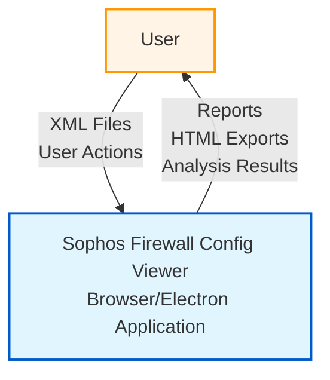
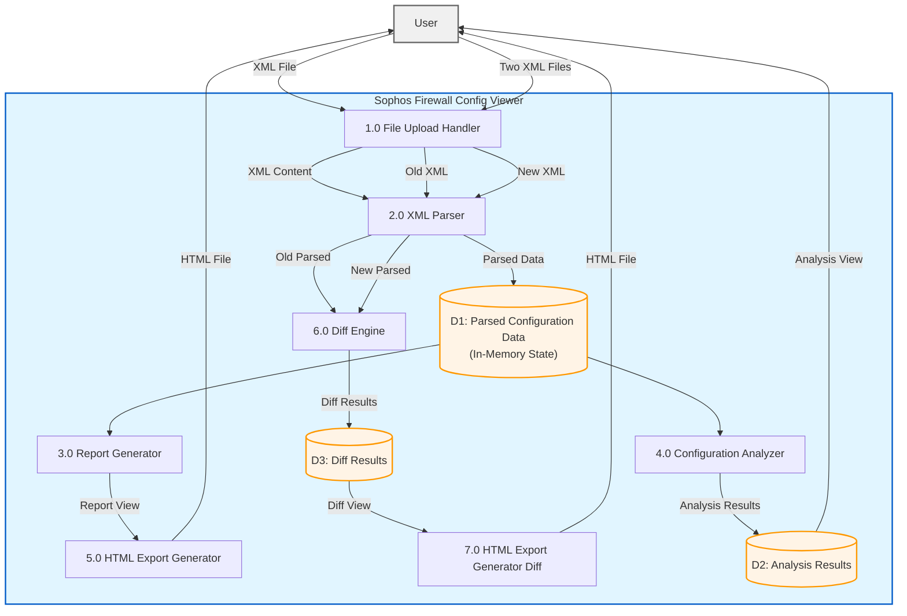
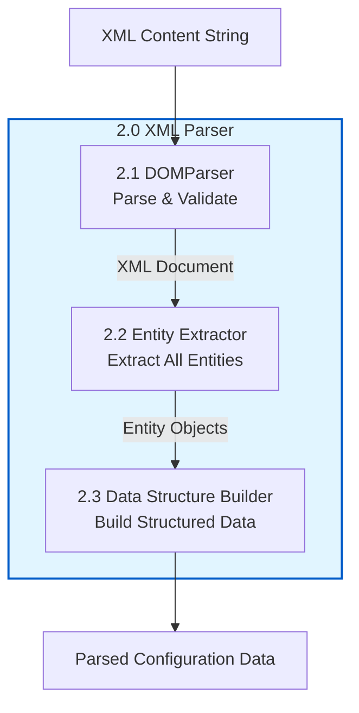
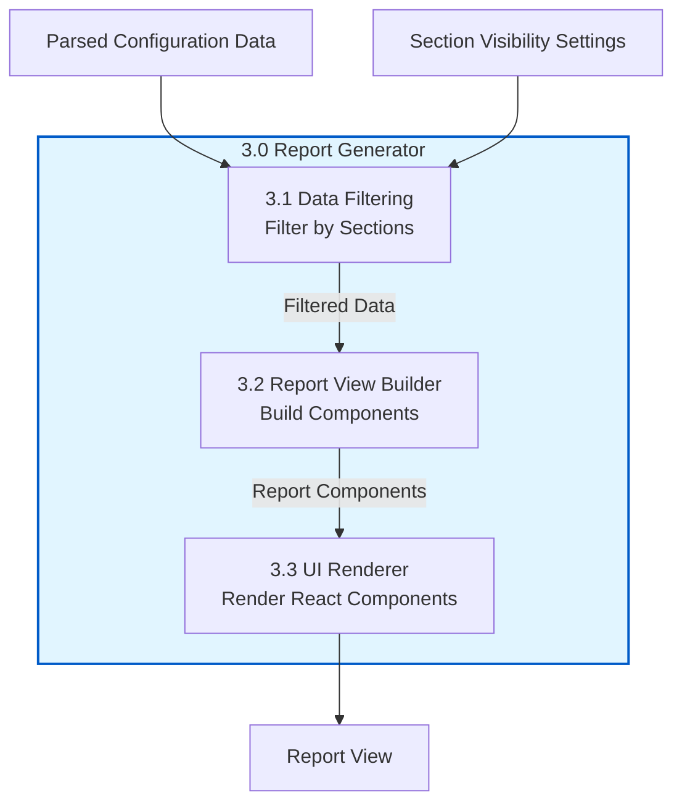
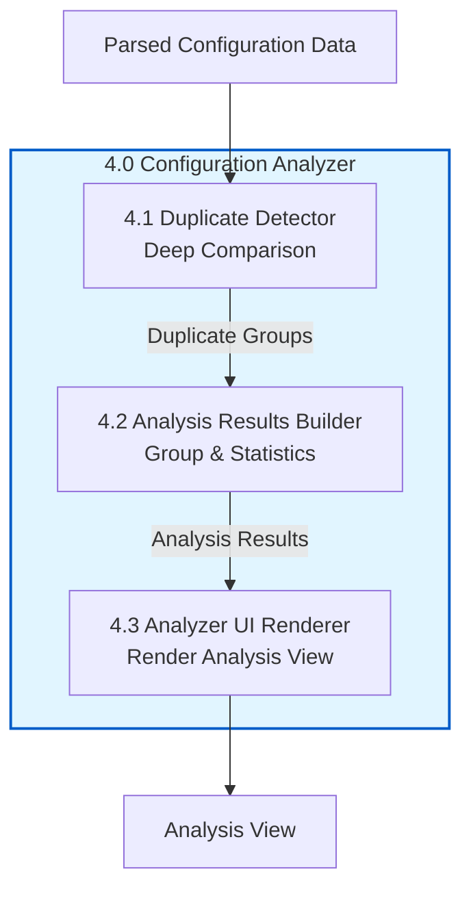
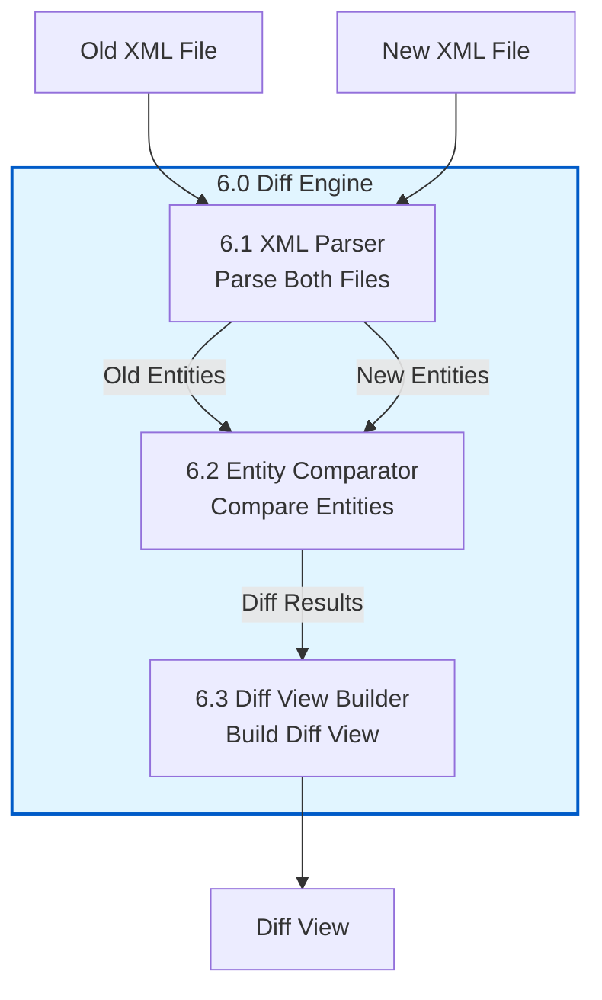
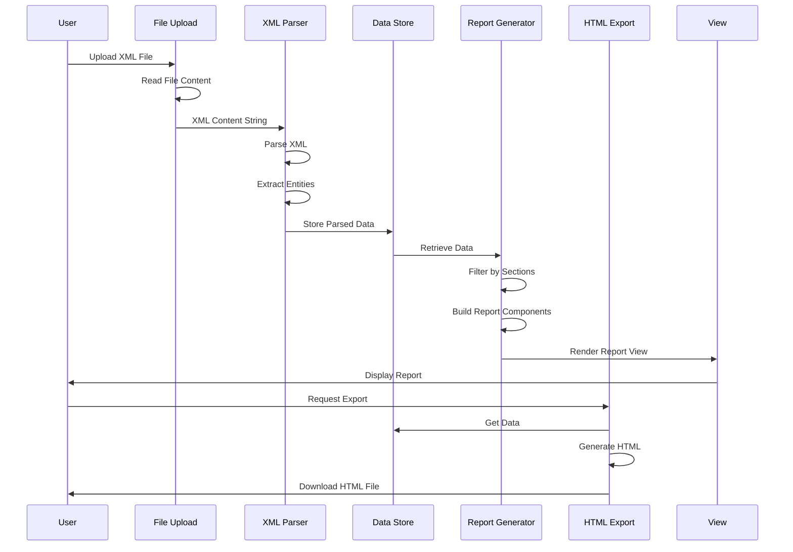
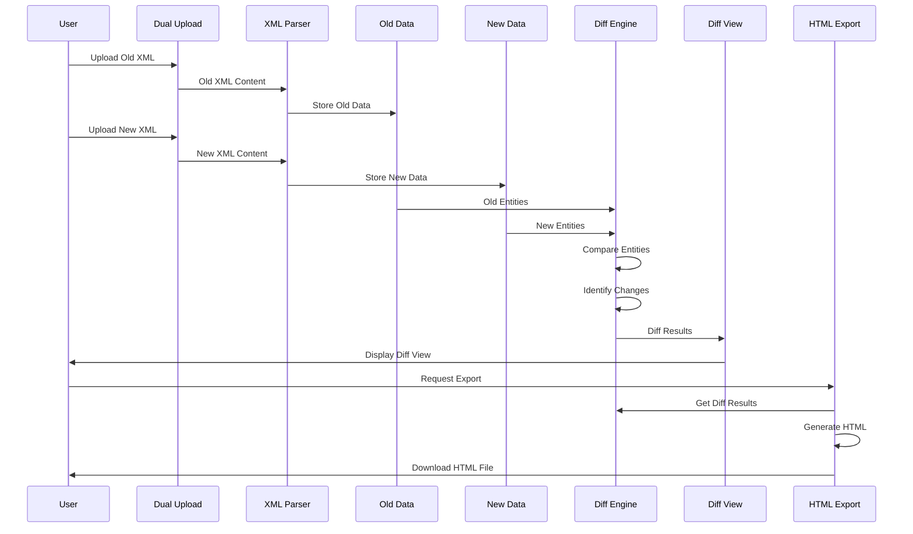

# Data Flow Diagram (DFD) - Mermaid Format

This file contains DFD diagrams in Mermaid format that can be rendered in markdown viewers that support Mermaid (GitHub, GitLab, many documentation tools).

## Context Diagram (Level 0)

## Level 1 DFD - Main Processes

## Level 2 DFD - XML Parser (Detailed)

## Level 2 DFD - Report Generator (Detailed)

## Level 2 DFD - Configuration Analyzer (Detailed)

## Level 2 DFD - Diff Engine (Detailed)

## Complete System Flow

```mermaid
flowchart LR
    User[User]
    
    subgraph Upload["Upload Phase"]
        U1[File Selection]
        U2[File Reading]
    end
    
    subgraph Processing["Processing Phase"]
        P1[XML Parsing]
        P2[Data Structuring]
    end
    
    subgraph Analysis["Analysis Phase"]
        A1[Report Generation]
        A2[Duplicate Detection]
        A3[Diff Comparison]
    end
    
    subgraph Output["Output Phase"]
        O1[UI Display]
        O2[HTML Export]
    end
    
    User -->|Upload| Upload
    Upload --> Processing
    Processing --> Analysis
    Analysis --> Output
    Output -->|View/Download| User
    
    style Upload fill:#e3f2fd,stroke:#1976d2
    style Processing fill:#f3e5f5,stroke:#7b1fa2
    style Analysis fill:#e8f5e9,stroke:#388e3c
    style Output fill:#fff3e0,stroke:#f57c00
```

## Data Flow - Single File Report

## Data Flow - Dual File Comparison

